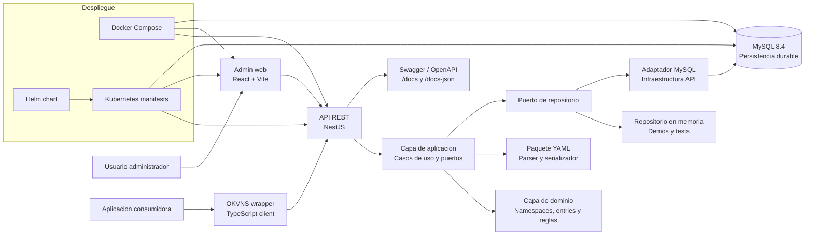

# TFM OKVNS - Documentacion del proyecto

## 1. Descripcion general del proyecto

OKVNS, siglas de **Organized Key-Value NamespaceS**, es una plataforma de configuracion en tiempo de ejecucion para aplicaciones y servicios. Su objetivo es permitir que equipos tecnicos gestionen valores de configuracion centralizados, organizados por espacios de nombres, sin tener que redesplegar las aplicaciones consumidoras cada vez que cambia un parametro.

El proyecto se ha desarrollado como Trabajo Fin de Master para BigSchool y cubre una solucion completa: dominio, casos de uso, API REST, interfaz web de administracion, persistencia durable, importacion/exportacion de datos y despliegue en contenedores.

La unidad principal de organizacion es el **namespace**. Cada namespace contiene una coleccion de **entries** o entradas clave-valor. Una entrada almacena un nombre, un valor UTF-8, una descripcion opcional, marcas temporales y un indicador que permite senalar si el valor depende del entorno, por ejemplo cuando una configuracion exportada de produccion debe revisarse antes de importarse en desarrollo o preproduccion.

El sistema esta pensado para escenarios donde distintas aplicaciones necesitan leer o mantener configuraciones compartidas como endpoints, claves logicas, banderas funcionales, textos configurables o valores operativos. En la primera version no se incluye autenticacion ni autorizacion; el foco esta en la arquitectura, el contrato funcional, la persistencia, la administracion visual y la preparacion para despliegues reproducibles.

URL del vídeo de presentacion del TFM: [https://www.youtube.com/watch?v=1Eub11l75rg](https://www.youtube.com/watch?v=1Eub11l75rg)

## 2. Stack tecnologico utilizado

El repositorio esta organizado como un monorepo TypeScript con pnpm. La solucion separa claramente las capas de dominio, aplicacion, infraestructura y presentacion para mantener bajo acoplamiento entre las reglas de negocio y los detalles tecnicos.

### Lenguajes y herramientas base

| Tecnologia          | Uso en el proyecto                                         |
| ------------------- | ---------------------------------------------------------- |
| TypeScript          | Lenguaje principal en paquetes, API y frontend.            |
| Node.js >= 22.22.1  | Runtime requerido para desarrollo y ejecucion local.       |
| pnpm 11.9.0         | Gestor de paquetes y workspaces del monorepo.              |
| ESLint              | Analisis estatico del codigo.                              |
| Prettier            | Formato automatico.                                        |
| Husky y lint-staged | Hooks y validaciones sobre cambios preparados para commit. |

### Backend

| Tecnologia        | Uso en el proyecto                                                |
| ----------------- | ----------------------------------------------------------------- |
| NestJS            | API REST principal en `apps/api`.                                 |
| MySQL 8.4         | Persistencia durable de namespaces y entries.                     |
| mysql2            | Cliente de acceso a MySQL desde la capa de infraestructura.       |
| OpenAPI / Swagger | Documentacion interactiva de la API en `/docs`.                   |
| Migraciones SQL   | Evolucion del esquema mediante ficheros en `apps/api/migrations`. |

### Frontend

| Tecnologia            | Uso en el proyecto                                            |
| --------------------- | ------------------------------------------------------------- |
| React                 | Interfaz de administracion.                                   |
| Vite                  | Desarrollo y compilacion del frontend.                        |
| React Testing Library | Pruebas de componentes y flujos de UI.                        |
| Nginx                 | Servir la aplicacion web dentro del contenedor de produccion. |

### Calidad, pruebas y despliegue

| Tecnologia          | Uso en el proyecto                                               |
| ------------------- | ---------------------------------------------------------------- |
| Vitest              | Pruebas unitarias y de integracion en paquetes y aplicaciones.   |
| @vitest/coverage-v8 | Cobertura de pruebas.                                            |
| Playwright          | Pruebas end-to-end del flujo web.                                |
| Docker              | Construccion de imagenes de API y frontend.                      |
| Docker Compose      | Ejecucion local de MySQL, migraciones, API y administracion web. |
| Kubernetes          | Manifiestos de referencia en `deploy/k8s`.                       |
| Helm                | Chart de despliegue en `deploy/helm/okvns`.                      |
| OpenSpec            | Especificacion y trazabilidad de cambios funcionales.            |

## 3. Instalacion y ejecucion

### 3.1. Requisitos previos

Para trabajar con el proyecto en local se necesita:

- Node.js `>= 22.22.1`.
- Corepack habilitado para usar la version de pnpm declarada por el proyecto.
- Docker y Docker Compose si se va a ejecutar la plataforma completa con MySQL.
- Un entorno capaz de ejecutar MySQL 8.4 si se opta por levantar la API fuera de Docker.

Habilitar Corepack:

```bash
corepack enable
```

Instalar dependencias:

```bash
pnpm install
```

### 3.2. Ejecucion rapida con Docker Compose

La forma mas directa de levantar el sistema completo es usar Docker Compose:

```bash
docker compose up --build
```

Este comando inicia:

- Un servicio MySQL 8.4.
- Un proceso de migracion que crea o actualiza el esquema.
- La API REST de OKVNS.
- La aplicacion web de administracion.

URLs locales con Docker Compose:

| Servicio           | URL                               |
| ------------------ | --------------------------------- |
| API REST           | `http://localhost:3000`           |
| Swagger UI         | `http://localhost:3000/docs`      |
| OpenAPI JSON       | `http://localhost:3000/docs-json` |
| Administracion web | `http://localhost:8081`           |
| MySQL              | `localhost:3306`                  |

URLs del despliegue publicado:

| Servicio             | URL                               |
| -------------------- | --------------------------------- |
| Administracion web   | `http://okvns.beshmo.es/`         |
| Documentacion de API | `http://okvns.beshmo.es/api/docs` |

Los datos se guardan en el volumen Docker `okvns-mysql-data`, por lo que sobreviven a reinicios de la API o del frontend. Para detener los contenedores sin borrar datos:

```bash
docker compose down
```

Para eliminar tambien los datos locales de MySQL:

```bash
docker compose down -v
```

### 3.3. Ejecucion local para desarrollo

La API usa MySQL por defecto. Para desarrollo se puede levantar MySQL con Docker:

```bash
docker compose up -d mysql
```

Aplicar migraciones:

```bash
pnpm --filter @okvns/api run migrate
```

Ejecutar la API:

```bash
pnpm --filter @okvns/api run start:dev
```

Ejecutar la administracion web en otro terminal:

```bash
pnpm --filter @okvns/admin-web run dev
```

URLs locales en modo desarrollo:

| Servicio                | URL                          |
| ----------------------- | ---------------------------- |
| API REST                | `http://localhost:3000`      |
| Swagger UI              | `http://localhost:3000/docs` |
| Administracion web Vite | `http://localhost:5173`      |

Para una demo rapida no durable, la API tambien admite el adaptador en memoria mediante:

```bash
OKVNS_STORAGE_DRIVER=memory pnpm --filter @okvns/api run start:dev
```

En ese modo los datos no sobreviven al reinicio del proceso.

### 3.4. Variables de configuracion principales

| Variable                         | Valor por defecto       | Descripcion                                  |
| -------------------------------- | ----------------------- | -------------------------------------------- |
| `OKVNS_API_PORT`                 | `3000`                  | Puerto HTTP de la API.                       |
| `OKVNS_CORS_ORIGIN`              | `*`                     | Origen permitido para CORS.                  |
| `OKVNS_STORAGE_DRIVER`           | `mysql`                 | Backend de persistencia: `mysql` o `memory`. |
| `OKVNS_MYSQL_HOST`               | Requerida con MySQL     | Host de la base de datos.                    |
| `OKVNS_MYSQL_PORT`               | `3306`                  | Puerto de MySQL.                             |
| `OKVNS_MYSQL_DATABASE`           | Requerida con MySQL     | Nombre de la base de datos.                  |
| `OKVNS_MYSQL_USER`               | Requerida con MySQL     | Usuario de MySQL.                            |
| `OKVNS_MYSQL_PASSWORD`           | Cadena vacia            | Contrasena de MySQL.                         |
| `OKVNS_MYSQL_POOL_LIMIT`         | `10`                    | Tamano maximo del pool de conexiones.        |
| `OKVNS_MYSQL_CONNECT_TIMEOUT_MS` | `10000`                 | Timeout de conexion en milisegundos.         |
| `VITE_OKVNS_API_BASE_URL`        | `http://localhost:3000` | URL base de la API para Vite en desarrollo.  |
| `OKVNS_API_BASE_URL`             | `http://localhost:3000` | URL base inyectada en el contenedor web.     |

### 3.5. Comandos de validacion

Comandos habituales desde la raiz del repositorio:

```bash
pnpm lint
pnpm typecheck
pnpm test
pnpm test:coverage
pnpm build
```

Pruebas end-to-end:

```bash
pnpm test:e2e:install
docker compose up -d mysql
pnpm test:e2e
```

El comando `pnpm test:e2e` compila API y frontend, aplica migraciones y ejecuta los flujos Playwright definidos en `e2e`.

## 4. Estructura del proyecto

La estructura principal del repositorio es la siguiente:

```text
.
|-- apps
|   |-- api
|   |-- admin-web
|   `-- demo-web
|-- packages
|   |-- domain
|   |-- application
|   |-- shared
|   |-- yaml
|   `-- okvns-wrapper
|-- docs
|   |-- adr
|   |-- tfm
|   |-- api-and-yaml.md
|   |-- architecture.md
|   |-- deployment.md
|   `-- engineering-practices.md
|-- deploy
|   |-- k8s
|   `-- helm
|-- docker
|-- e2e
|-- openspec
|-- docker-compose.yml
|-- package.json
|-- pnpm-workspace.yaml
`-- README.md
```

### 4.1. Aplicaciones

| Ruta             | Responsabilidad                                                                                                     |
| ---------------- | ------------------------------------------------------------------------------------------------------------------- |
| `apps/api`       | API REST NestJS, controladores, DTOs, configuracion, health checks, persistencia MySQL, repositorios y migraciones. |
| `apps/admin-web` | Aplicacion React/Vite para administrar namespaces, entries e importacion/exportacion YAML.                          |
| `apps/demo-web`  | Aplicacion de demostracion para consumo del sistema.                                                                |

### 4.2. Paquetes compartidos

| Ruta                     | Responsabilidad                                                                           |
| ------------------------ | ----------------------------------------------------------------------------------------- |
| `packages/domain`        | Entidades, objetos de valor, reglas de validacion y errores de negocio.                   |
| `packages/application`   | Casos de uso, puertos de repositorio, consultas de listado y orquestacion de operaciones. |
| `packages/shared`        | Tipos, constantes y utilidades sin dependencias de framework.                             |
| `packages/yaml`          | Parser y serializador YAML con contrato estricto de importacion/exportacion OKVNS.        |
| `packages/okvns-wrapper` | Cliente TypeScript externo para leer valores de OKVNS desde otras aplicaciones.           |

### 4.3. Documentacion, despliegue y pruebas

| Ruta                                   | Responsabilidad                                                               |
| -------------------------------------- | ----------------------------------------------------------------------------- |
| `docs/api-and-yaml.md`                 | Referencia de endpoints REST, formato de errores, paginacion y contrato YAML. |
| `docs/architecture.md`                 | Arquitectura, capas, reglas de dependencia y configuracion.                   |
| `docs/deployment.md`                   | Ejecucion con Docker Compose, Kubernetes, Helm, imagenes y migraciones.       |
| `docs/engineering-practices.md`        | Practicas de implementacion, testing y calidad.                               |
| `docs/tfm/okvns-tfm-presentacion.pdf`  | Presentacion del TFM preparada para la defensa del proyecto.                  |
| `docs/adr`                             | Registro de decisiones de arquitectura.                                       |
| `deploy/k8s`                           | Manifiestos Kubernetes de referencia.                                         |
| `deploy/helm/okvns`                    | Chart Helm del despliegue.                                                    |
| `e2e`                                  | Pruebas end-to-end con Playwright.                                            |
| `openspec`                             | Especificaciones funcionales y cambios historicos.                            |

### 4.4. Esquema de componentes



## 5. Funcionalidades principales

### 5.1. Gestion de namespaces

El sistema permite crear, consultar, listar, actualizar y eliminar namespaces. Un namespace agrupa entradas relacionadas y puede tener una descripcion funcional. Los listados admiten paginacion, ordenacion y filtrado por nombre para facilitar la administracion de conjuntos grandes.

Endpoints principales:

- `GET /namespaces`
- `POST /namespaces`
- `GET /namespaces/:name`
- `PUT /namespaces/:name`
- `DELETE /namespaces/:name`

### 5.2. Gestion de entries

Dentro de cada namespace se pueden administrar entries clave-valor. Cada entrada incluye:

- Nombre unico dentro del namespace.
- Valor UTF-8.
- Descripcion opcional.
- Indicador `env_dependent`.
- Fechas `created_at` y `modified_at`.

Endpoints principales:

- `GET /namespaces/:name/entries`
- `POST /namespaces/:name/entries`
- `GET /namespaces/:name/entries/:entry`
- `PUT /namespaces/:name/entries/:entry`
- `DELETE /namespaces/:name/entries/:entry`

### 5.3. Validacion de nombres y datos

Los nombres de namespaces y entries se validan de forma uniforme en dominio, API e importacion YAML. Deben ser cadenas UTF-8 no vacias, normalizadas sin espacios exteriores, con longitud maxima de 128 caracteres y compatibles con el patron permitido por el proyecto.

Las descripciones son opcionales y tienen una longitud maxima de 1000 caracteres. Los valores de las entries deben ser cadenas. El campo `env_dependent` solo acepta booleanos.

### 5.4. Importacion y exportacion YAML

OKVNS ofrece operaciones de importacion y exportacion para facilitar copias, auditorias y migraciones entre entornos.

Endpoints principales:

- `POST /yaml/import`
- `GET /yaml/export`
- `GET /yaml/export/:name`

La importacion acepta el formato canonico:

```yaml
namespaces:
  - name: users
    description: Accounts for the admin console.
    entries:
      - name: admin
        value: secret
        description: API key used by the admin console.
        env_dependent: false
```

Tambien acepta una forma heredada con una unica clave `namespace`. La exportacion siempre emite YAML canonico con `namespaces: [...]`.

La importacion valida todo el documento antes de modificar datos. Si hay claves inesperadas, nombres duplicados, entradas duplicadas, tipos incorrectos, descripciones demasiado largas o YAML invalido, la operacion falla sin aplicar cambios parciales.

### 5.5. Persistencia durable en MySQL

La informacion se almacena en MySQL mediante tablas relacionales para namespaces y entries. La relacion entre ambas usa eliminacion en cascada, de forma que al borrar un namespace se eliminan sus entries asociadas. Las operaciones compuestas, como renombrados o importaciones multi-namespace, se ejecutan dentro de transacciones.

El proyecto conserva un adaptador en memoria para pruebas y demos rapidas, pero el backend por defecto es MySQL.

### 5.6. Interfaz web de administracion

La aplicacion `apps/admin-web` permite operar el sistema desde navegador. Incluye flujos para:

- Ver y filtrar namespaces.
- Crear, editar y eliminar namespaces.
- Consultar entries de un namespace.
- Crear, editar y eliminar entries.
- Identificar visualmente entries dependientes del entorno.
- Importar YAML.
- Exportar YAML global o por namespace.
- Mostrar errores seguros procedentes de la API.

### 5.7. API documentada y errores seguros

La API expone documentacion Swagger en `http://localhost:3000/docs` cuando el servicio esta en marcha. Los errores devueltos por la API siguen una forma segura:

```json
{ "error": { "code": "VALIDATION_ERROR", "message": "...", "details": ["..."] } }
```

El objetivo es evitar fugas de trazas internas o detalles de infraestructura en las respuestas HTTP.

### 5.8. Health checks y readiness

La API proporciona endpoints de salud para despliegues automatizados:

- `GET /health`: comprueba que el proceso esta vivo.
- `GET /ready`: comprueba que el servicio esta preparado para recibir trafico.

En modo MySQL, la readiness depende de la conectividad con la base de datos y de que el esquema este disponible.

### 5.9. Despliegue en contenedores y Kubernetes

El proyecto esta preparado para ejecutarse como servicios stateless en contenedores. Docker Compose cubre el entorno local completo, mientras que `deploy/k8s` y `deploy/helm/okvns` sirven como referencia para despliegues en Kubernetes.

La configuracion de runtime se inyecta mediante variables de entorno, ConfigMaps y Secrets. La persistencia queda fuera de los contenedores de aplicacion y se delega en MySQL.

### 5.10. Estrategia de pruebas

La solucion incluye una estrategia de pruebas por capas:

- Pruebas unitarias de dominio y casos de uso con Vitest.
- Pruebas del parser y serializador YAML.
- Pruebas de repositorios en memoria y MySQL.
- Pruebas de contrato HTTP de la API.
- Pruebas de componentes React.
- Pruebas end-to-end con Playwright sobre los flujos principales.

Esta combinacion permite validar tanto reglas internas como contratos externos y comportamiento de usuario.

## 6. Especificaciones OpenSpec

El proyecto utiliza OpenSpec con `schema: spec-driven`. Esto significa que las capacidades se describen primero como especificaciones, escenarios y cambios trazables; despues se implementan y se archivan cuando quedan validadas. Las especificaciones vivas estan en `openspec/specs`, mientras que los cambios completados estan en `openspec/changes/archive`.

OpenSpec aporta tres ventajas principales al TFM:

- Mantiene una relacion explicita entre requisito, diseno, tareas e implementacion.
- Permite revisar los cambios historicos por fecha y capacidad afectada.
- Evita que la documentacion funcional dependa solo del codigo final.

### 6.1. Especificaciones actuales

| Especificacion             | Alcance principal                                                                                                                                                                                  |
| -------------------------- | -------------------------------------------------------------------------------------------------------------------------------------------------------------------------------------------------- |
| `okvns-domain`             | Identidad y validacion de namespaces y entries, unicidad de entries por namespace, errores de dominio y aislamiento frente a frameworks.                                                           |
| `namespace-management`     | CRUD de namespaces, listados paginados, filtros, ordenacion, descripciones, timestamps y contrato HTTP.                                                                                            |
| `entry-management`         | CRUD de entries, paginacion, filtros, ordenacion, descripciones, `env_dependent`, timestamps y validacion de frontera.                                                                             |
| `markdown-bulk-operations` | Importacion/exportacion YAML, validacion estricta, atomicidad, upsert de namespaces y compatibilidad con forma heredada. El nombre historico conserva la referencia al contrato markdown anterior. |
| `persistent-storage`       | Persistencia durable en MySQL, restricciones relacionales, transacciones, migraciones y readiness dependiente del esquema.                                                                         |
| `admin-frontend`           | Interfaz web para namespaces, entries, importacion/exportacion YAML, errores seguros, timestamps, paginacion y flujos E2E iniciales.                                                               |
| `api-documentation`        | Documento OpenAPI generado, Swagger UI y esquemas documentados para rutas, peticiones, respuestas y probes.                                                                                        |
| `deployment-foundation`    | Docker Compose, Kubernetes, Helm, configuracion por entorno, health checks, readiness, persistencia y publicacion de imagenes.                                                                     |
| `okvns-wrapper-library`    | Cliente TypeScript externo para leer valores de entries, manejo de valores por defecto, errores y `fetch` configurable.                                                                            |

### 6.2. Flujo de cambio seguido

Cada cambio OpenSpec se compone de:

- `proposal.md`: explica el motivo, el alcance, las capacidades afectadas y el impacto tecnico.
- `design.md`: concreta las decisiones relevantes cuando el cambio necesita diseno previo.
- `tasks.md`: desglosa el trabajo verificable.
- `specs/**/spec.md`: modifica o anade requisitos y escenarios.

Una vez implementado y validado, el cambio se mueve a `openspec/changes/archive/<fecha>-<nombre>`. La siguiente lista esta ordenada por fecha descendente.

| Fecha      | Cambio OpenSpec archivado                | Resumen                                                                                                                                                         |
| ---------- | ---------------------------------------- | --------------------------------------------------------------------------------------------------------------------------------------------------------------- |
| 2026-07-16 | `publish-production-docker-images`       | Anade flujo CI para construir imagenes de produccion de API y admin web, validar builds en pull requests y publicar en Docker Hub desde referencias confiables. |
| 2026-07-16 | `add-helm-deployment-chart`              | Actualiza manifiestos Kubernetes para usar imagenes publicadas y anade chart Helm configurable equivalente al despliegue de referencia.                         |
| 2026-07-15 | `add-api-backed-list-pagination`         | Cambia listados de namespaces y entries a respuestas paginadas con filtros, ordenacion y controles soportados por API y frontend.                               |
| 2026-07-15 | `add-entry-env-dependent-metadata`       | Incorpora el metadato booleano `env_dependent` en entries, API, YAML, persistencia y administracion web.                                                        |
| 2026-07-14 | `add-resource-descriptions`              | Anade descripciones opcionales a namespaces y entries, con validacion, persistencia, API, YAML y UI.                                                            |
| 2026-07-14 | `expose-resource-timestamps`             | Expone `created_at` y `modified_at` en recursos y ajusta la semantica de modificacion ante cambios propios o de entries.                                        |
| 2026-07-13 | `add-okvns-wrapper-library`              | Crea el paquete cliente TypeScript para que aplicaciones externas lean valores de OKVNS mediante la API.                                                        |
| 2026-07-13 | `add-openapi-documentation`              | Genera documentacion OpenAPI/Swagger de la API y documenta rutas, esquemas y contratos relevantes.                                                              |
| 2026-07-13 | `mysql-storage-implementation`           | Sustituye el almacenamiento por defecto en memoria por persistencia durable en MySQL con migraciones, repositorio y readiness.                                  |
| 2026-07-09 | `add-admin-yaml-multipart-import`        | Extiende la administracion web para importar YAML mediante subida de fichero.                                                                                   |
| 2026-07-09 | `add-yaml-multipart-import`              | Anade soporte API para importacion YAML multipart, validacion y limites de payload.                                                                             |
| 2026-07-09 | `replace-markdown-bulk-format-with-yaml` | Sustituye el contrato anterior basado en markdown por YAML canonico para importacion y exportacion.                                                             |
| 2026-07-08 | `build-okvns-service`                    | Construye la base inicial del servicio: dominio, casos de uso, API, frontend, YAML, pruebas, Docker Compose y despliegue de referencia.                         |

## 7. Architecture Decision Records

El proyecto documenta sus decisiones tecnicas principales mediante ADRs en `docs/adr`. Cada ADR registra el contexto, la decision adoptada, su estado y sus consecuencias. Esto permite justificar por que el sistema usa determinadas tecnologias y limites arquitectonicos, incluso cuando una decision queda sustituida por otra posterior.

| ADR        | Decision                                                    | Estado                 | Comentario                                                                                                                                                                                                              |
| ---------- | ----------------------------------------------------------- | ---------------------- | ----------------------------------------------------------------------------------------------------------------------------------------------------------------------------------------------------------------------- |
| `ADR-0001` | Usar un monorepo TypeScript con pnpm                        | Accepted               | Centraliza API, frontend y paquetes compartidos en un unico repositorio. Facilita comandos globales de build, lint y test, y permite versionar contratos compartidos junto con su implementacion.                       |
| `ADR-0002` | Usar limites de arquitectura limpia                         | Accepted               | Establece la separacion entre dominio, aplicacion, infraestructura y presentacion. La consecuencia mas importante es que las reglas de negocio no dependen de NestJS, React, navegador ni persistencia.                 |
| `ADR-0003` | Usar almacenamiento en memoria para el MVP                  | Superseded by ADR-0008 | Fue una decision temporal para construir el MVP sin fijar prematuramente el modelo operacional. Permitio iterar rapido, pero no ofrecia durabilidad y quedo sustituida al introducir MySQL.                             |
| `ADR-0004` | Usar un contrato YAML estricto de OKVNS                     | Accepted               | Define `/yaml/*` como interfaz de importacion/exportacion, con YAML crudo y forma canonica `namespaces: [...]`. Obliga a validar todo el documento antes de mutar almacenamiento, evitando cambios parciales.           |
| `ADR-0005` | Usar NestJS para la API y React/Vite para el frontend admin | Accepted               | Fija el stack de presentacion: NestJS para controladores, validacion, probes y contratos REST; React/Vite para una administracion web rapida y testeable. Tambien exige aislar el cliente API de los componentes React. |
| `ADR-0006` | Usar despliegue stateless en contenedores                   | Accepted               | La API y el frontend se empaquetan como contenedores y reciben configuracion por entorno. Tras ADR-0008, la aplicacion sigue siendo stateless, pero la durabilidad depende de MySQL como servicio externo.              |
| `ADR-0007` | Usar estrategia de pruebas por capas y errores API seguros  | Accepted               | Formaliza pruebas unitarias, de contrato HTTP, de componentes y E2E. Tambien fija una forma de error segura para no exponer trazas, rutas internas, secretos ni detalles de infraestructura.                            |
| `ADR-0008` | Usar MySQL para almacenamiento durable                      | Accepted               | Sustituye el almacenamiento en memoria como backend por defecto. Introduce tablas relacionales, restricciones de unicidad, transacciones, migraciones SQL y readiness dependiente de conectividad y esquema MySQL.      |

En conjunto, los ADRs muestran la evolucion del proyecto: primero se priorizo construir un MVP simple y testeable; despues se consolidaron las decisiones de arquitectura, contrato YAML, frontend/backend, despliegue, pruebas y persistencia durable.

## 8. Cobertura de pruebas

La tabla resume la cobertura obtenida con `pnpm test:coverage` ejecutado el 17/07/2026. Los porcentajes son los agregados `All files` mostrados por Vitest para cada workspace.

| Capa / modulo                  | Workspace                | Tests                   | Statements | Branches | Functions | Lines  | Observaciones                                                                                                       |
| ------------------------------ | ------------------------ | ----------------------- | ---------- | -------- | --------- | ------ | ------------------------------------------------------------------------------------------------------------------- |
| Tipos y utilidades compartidas | `packages/shared`        | 11 passed               | 100%       | 100%     | 100%      | 100%   | Paquete independiente de framework.                                                                                 |
| Dominio                        | `packages/domain`        | 79 passed               | 100%       | 100%     | 100%      | 100%   | Cubre entidades, objetos de valor, validaciones y errores.                                                          |
| Aplicacion                     | `packages/application`   | 92 passed               | 100%       | 100%     | 100%      | 100%   | Cubre casos de uso, consultas y puertos.                                                                            |
| YAML                           | `packages/yaml`          | 42 passed               | 100%       | 100%     | 100%      | 100%   | Cubre parser, serializador y errores de contrato.                                                                   |
| Cliente externo                | `packages/okvns-wrapper` | 18 passed               | 100%       | 100%     | 100%      | 100%   | Cubre lectura, valores por defecto, errores y `fetch` inyectable.                                                   |
| API e infraestructura          | `apps/api`               | 134 passed / 46 skipped | 66.17%     | 92.83%   | 70.78%    | 66.17% | Incluye contrato HTTP y repositorio en memoria; las pruebas MySQL de integracion quedan omitidas en esta ejecucion. |
| Administracion web             | `apps/admin-web`         | 83 passed               | 93%        | 85.47%   | 86.13%    | 93%    | Cubre cliente API, paginas principales, formularios, errores y controles de listado.                                |
| Demo web                       | `apps/demo-web`          | 4 passed                | 71.76%     | 81.81%   | 75%       | 71.76% | Aplicacion auxiliar de demostracion.                                                                                |
| End-to-end                     | `e2e`                    | No medido por cobertura | N/A        | N/A      | N/A       | N/A    | Playwright valida flujos completos, pero no genera porcentaje de cobertura de codigo en este comando.               |

La cobertura mas alta se concentra en dominio, aplicacion, YAML y wrapper, que son las capas con mayor densidad de reglas. La API presenta menor cobertura agregada porque el informe incluye esquemas, configuracion y adaptadores MySQL cuyas pruebas de integracion se omiten por defecto si no se activa el entorno MySQL de test.
